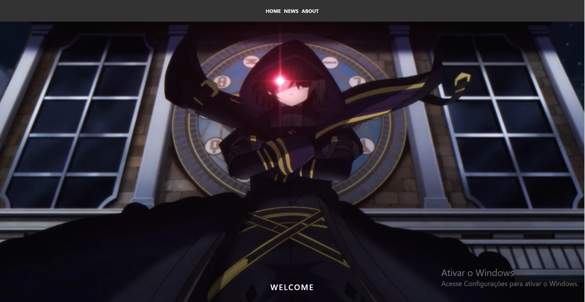
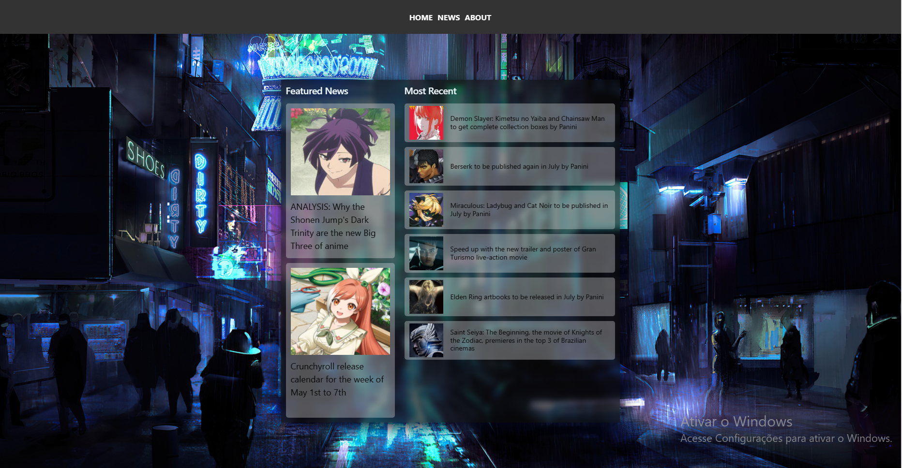
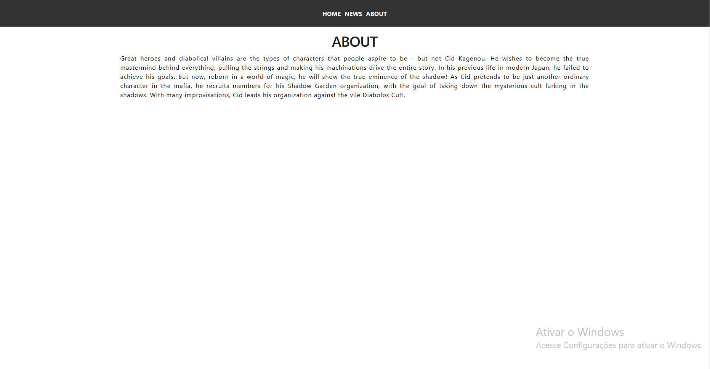
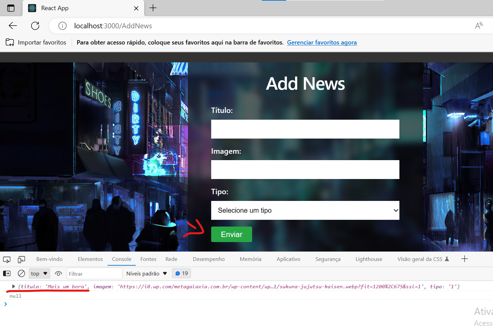
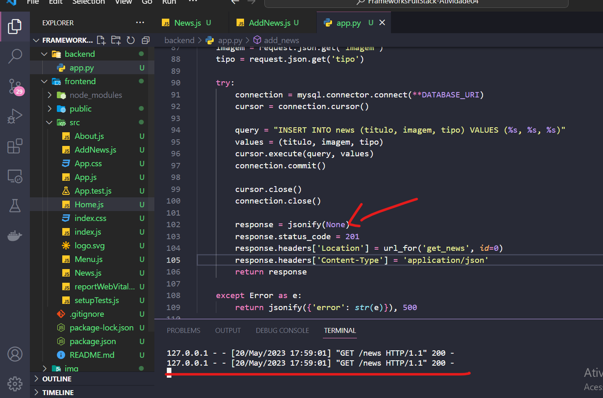
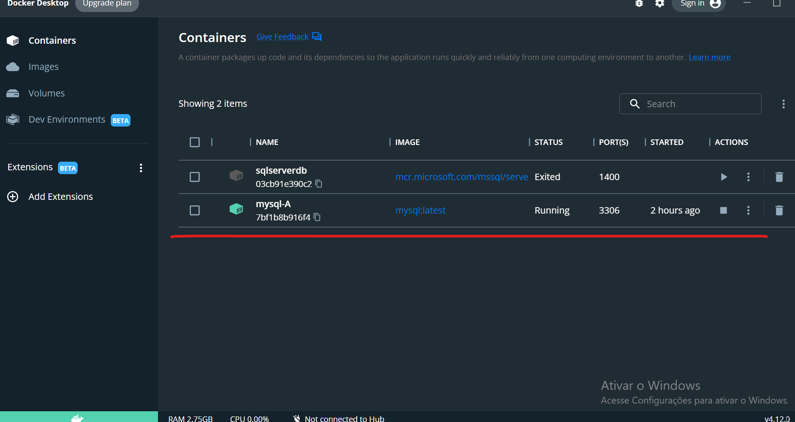
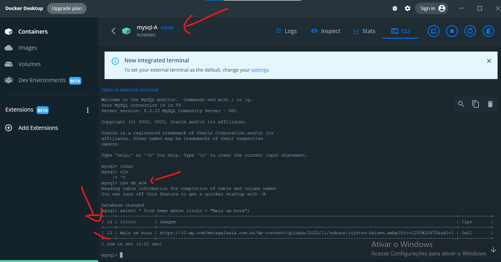

# Frameworks FullStack - AC4

Criar uma estrutura no backend em Python onde exista pelo menos 2 rotas (Methods GET e POST) que possam se comunicar com uma estrutura de banco de dados e executando as ações de cada um dos Methods. Após finalizado armazenar o arquivo em um repositório (git) e enviar no campo abaixo.
Além dessa estrutura responda a questão correspondente ao banco de dados.

# Banco de dados
```
-- Criar container mysql
docker run -e MYSQL_ROOT_PASSWORD=Senha123 --name mysql-A -d -p 3306:3306 --volume=/data/mysql-A:/var/lib/mysql mysql --bind-address=0.0.0.0

-- Acessar shell do container
docker exec -it mysql-A bash

-- Conectar-se ao servidor MySQL
mysql -uroot -pSenha123

## Script de criação do banco e as tabelas no repositorio
```
## Telas da Aplicação
<div align="center">
  
  
  
  
  
  
  
  
</div>
